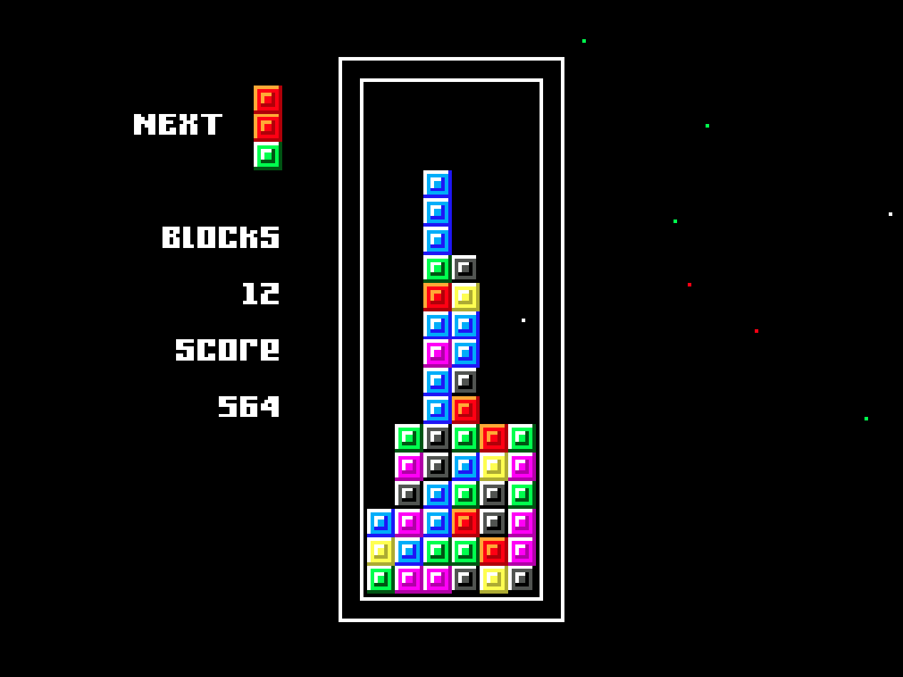

Here's a small project I made over the course of a few hours one weekend in 2020.  I was playing a lot of retro video games, one in particular was [Columns](https://en.wikipedia.org/wiki/Columns_(video_game)) a sort of twist on Tetris.

I was looking for a project and this felt like a simple enough game where I could practice something different.  So I used Phaser JS to give it a go and for something that was "quick and dirty" I'm pleased with how it turned out.

It was never really finished so you're pretty much just thrown into the game and you'll need to refresh the page when the game ends.  Now I have started to learn [Godot](https://godotengine.org/), I think this is a good candidate to port, finish and improve!

<figure class="md:-mx-12">

<figcaption class="text-center">Columns built with Phaser JS - <a href="https://columns.wtsn.dev" target="_blank">Play here</a></figacaption>
</figure>